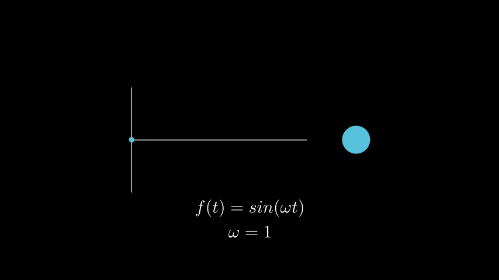
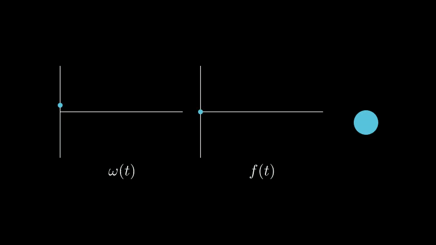
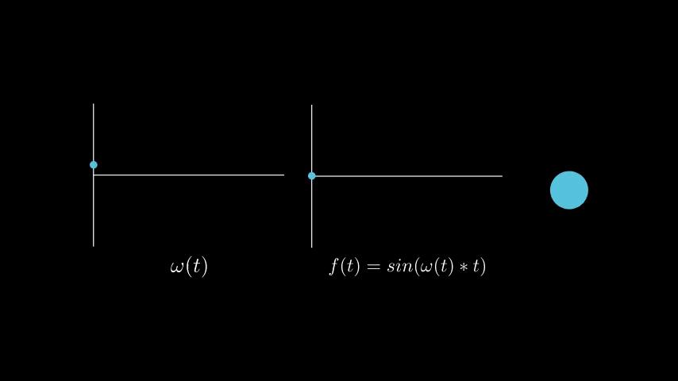
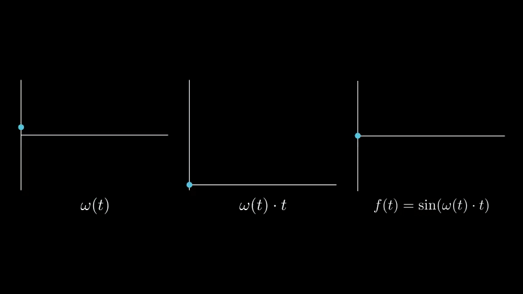
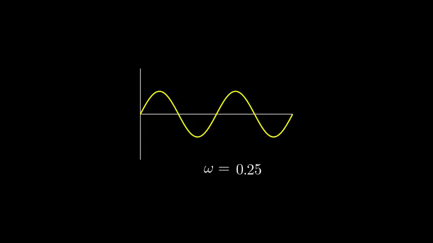
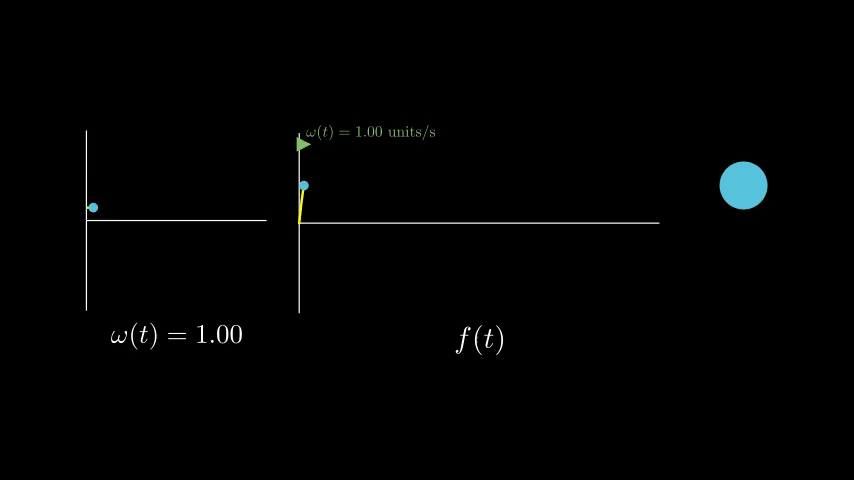
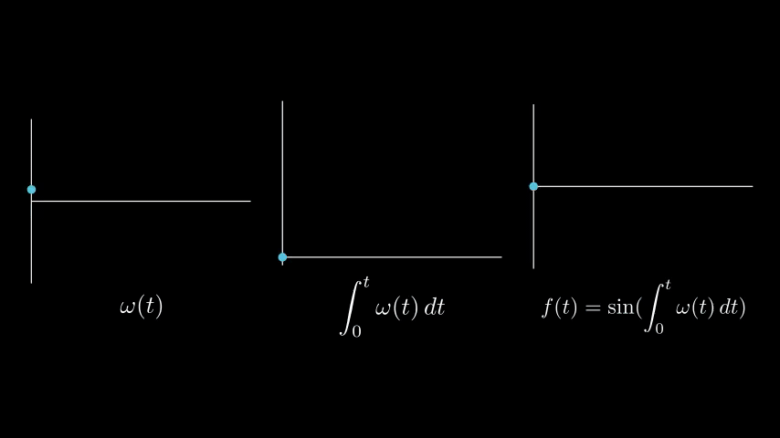
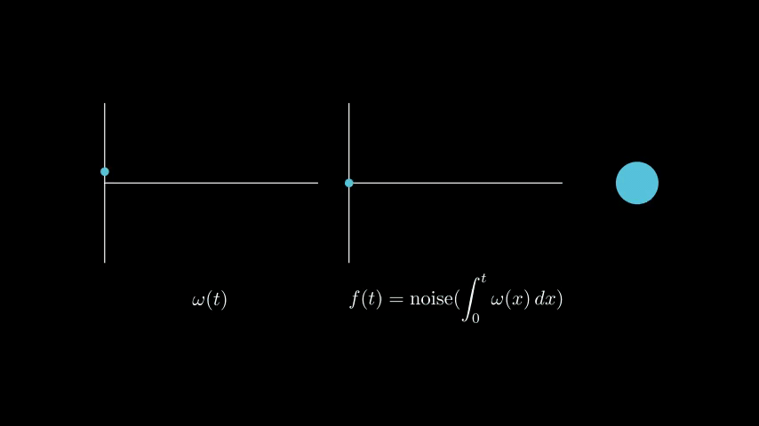

# Variable Rate Function Traversal

A method for changing the rate at which a function (such as an animation curve) is traversed over time, some of its applications, and a Maya expression that implements it.

## The Setup

Let's say we have a function $f(t)$ that we're using to animate the position of an object over time. If we wanted to make the object bounce up and down, we could model that using $f(t) = \sin(\omega t)$, where $t$ is the current time and $\omega$ is the angular frequency (which defines how fast the object oscillates):

This works fine when $\omega$ is constant, but what if we want to make the object speed up and slow down as it wiggles? Instead of a constant $\omega$, we would need a function $\omega (t)$ that defines what the angular frequency should be at a given time:

Now we have a new question: how should we define $f(t)$? The first thing we could try is plugging $\omega (t)$ into the function we had before, which would give us $f(t) = \sin(\omega (t) \cdot t)$. However, doing so gives us some unwanted behavior:

When the value of $\omega (t)$ is constant, $f(t)$ behaves the way we want it to. But as soon as $\omega (t)$ starts changing, $f(t)$ starts oscillating much faster than it should for the current $\omega$ value. Then, it abruptly slows down once $\omega (t)$ becomes constant again. To understand why this happens, we can look at how $\omega(t) \cdot t$ changes over time:

When $\omega (t)$ is constant, $\omega(t) \cdot t$ increases linearly with $t$. But once $\omega (t)$ starts increasing too, it multiplies with the already increasing $t$ to create a significant jump in the overall rate of change of $\omega(t)\cdot t$. The function $f(t) = \sin(\omega t)$ is only able to model oscillating motion when $\omega$ is constant. If we want to vary $\omega$ over time, we're going to need to find a different function.

In order to do this, it can be helpful to change how we think about the effect that $\omega$ has on $\sin(t)$. A common way of understanding $\omega$ is to think of it as controlling the "stretchiness" of the function. Lower $\omega$ values expand it, resulting in slower oscillation, and higher $\omega$ values compress it, resulting in faster oscillation:

However, we can also think of $\omega$ as setting the rate at which we traverse the horizontal axis when evaluating $\sin(t)$. This graph of $f(t)$ is modelled differently, but the final outcome for the oscillating object is the same:

This way of thinking about $\omega$ is a bit more convoluted than the stretchiness model, but it creates an interesting property: we are now thinking of $\omega$ as the velocity of traversal, which means we can integrate it to get a position. 

If $\omega (t)$ represents the rate at which we're traversing the horizontal axis, then $\int_{0}^t \omega (x) \\, dx$ represents the current horizontal position at time $t$. That essentially means that $\int_{0}^t \omega (x) \\, dx$ is an expression that tells us what number to plug in to our oscillating function in order to model a changing $\omega$ at time $t$. In other words, it's our solution:

$$ f(t) =\sin(\int_{0}^t \omega (x) \\, dx) $$

Now we can revisit our examples from before with our new definition for $f(t)$. If we look at how $\int_{0}^t \omega (x) \\, dx$ changes over time, we see a smooth transition instead of the sharp one that $\omega (t) \cdot t$ yielded:

And when we apply this function to our oscillating object, we get the desired result:

As an additional way to check our work, we can look at how our new function reacts if $\omega(t)$ is constant. Let's make $\omega(t)$ a constant function:
$$\omega(t) = \omega_1$$
Then $\int_{0}^t \omega (x) \\, dx$ evaluates as follows:
$$\int_{0}^t \omega (x) \\, dx = \int_{0}^t \omega_1 \\, dx = \omega_1t$$
So we end up with:
$$f(t) =\sin(\int_{0}^t \omega (x) \\, dx) = \sin(\omega_1t)$$
Which is the same function that we started with when $\omega$ was constant. This makes $f(t)=\sin(\omega t)$ a special case of the more general function $f(t) =\sin(\int_{0}^t \omega (x) \\, dx)$ for constant $\omega(t)$.

## The General Solution and Some Applications

While I used $\sin$ as an example, the above solution can be generalized to any function that animates over time. For any continuous function $g(t)$, an integrable function $\omega(t)$ can be used to change the rate at which $g(t)$ is traversed:

$$f(t) =g(\int_{0}^t \omega (x) \\, dx)$$

Here's an example using a noise function:

Another interesting property of this function is that negative $\omega$ values will reverse the traversal direction of $g(t)$, which can be used to create symmetry:

Finally, here's an example of how I used this function in my short film [Whittled Down](https://whittleddownfilm.ollyglenn.com). I used a noise function to make the creature's teeth undulate, then applied this function to make them move faster right before the creature strikes.

## Implementation

The Maya scene `oscillate-demo.ma` contains an example of how one could implement variable rate function traversal using a Maya expression. The `oscillation_controller` curve has attributes `frequency`, `amplitude`, `oscillationCenter`, `phase`, and `timeOffset` to control the sinusoidal oscillation of the `translateY` attribute of `cube`. Keying the `frequency` attribute of the controller will create the desired speeding-up-and-slowing-down behavior in the cube's oscillation.

Let's map the components of our Maya scene to the elements of $f(t) =g(\int_{0}^t \omega (x) \\, dx)$. Our $t$ is the frame number, our $\omega (t)$ is the `oscillation_controller.frequency` attribute's animation curve, our $g(t)$ is $\sin (t)$, and our $f(t)$ controls `cube.translateY`.

The expression in this scene works by querying the value of the `frequency` attribute on every frame and using that information to take a Riemann sum of the `frequency` attribute's animation curve to approximate the integral $\int_{0}^t \omega (x) \\, dx$.

Unfortunately, this method creates a major performance drawback: it requires an increasing amount of queries to the value of `frequency` as the frame count gets higher. For every single frame of animation, all of the `frequency` values of the preceding frames must be summed together to approximate the current value of  $\int_{0}^t \omega (x) \\, dx$. Frame $3$ requires the values at frames $2$ and $1$ to be summed, frame $4$ requries the values at $3$, $2$, and $1$ to be summed, and so on. This isn't an issue for short animations, but as animations get longer, the number of total operations needed to calculate the animation increases quadratically, ultimately creating a program that runs in $O(n^2)$ time (where $n$ is the number of frames):

$$ \sum_{t=1}^n t = \frac{n(n+1)}{2} = \frac{n^2+n}{2} \Rightarrow O(n^2)$$

In simpler terms, the expression gets really slow for big frame numbers.

The simplest workaround for this performance issue is to bake the animation when it's finished to mitigate the performance effects this expression would have on the rest of the scene. However, that doesn't do anything to speed up the expression while it's running.

This expression also requires Maya's cached playback to be disabled, which significantly hurts the performance of all cacheable animations in the scene.

A more performant solution to this problem would be to implement a system that allows the summed `frequency` values to be cached, only recalculating them when the animation curve controlling the `frequency` is changed. However, as far as I'm aware this sort of functionality is beyond the scope of what can be accomplished with an expression and introduces a significant amount of complexity to this tool. For my use case (individual shots of a film split into separate Maya scenes that are usually less than fifteen seconds long), the simplicity of this expression outweighs the performance issues that one would run into in longer and heavier scenes.

## Summary

The function $f_a(t) = \sin(\omega t)$, where $\omega$ is the angular frequency and $t$ is time, can be used to model oscillating motion. However, it only works if $\omega$ is constant. If $\omega$ is instead a function $\omega (t)$, then the motion is represented by $f_b(t) =\sin(\int_{0}^t \omega (x) \\, dx)$. The original function, $f_a(t) = \sin(\omega t)$, is a special case of $f_b(t)$ for constant $\omega (t)$.

This solution can then be generalized to any function that animates over time. For any continuous function $g(t)$, an integrable function $\omega(t)$ can be used to change the rate at which $g(t)$ is traversed using the function: 
$$f(t) =g(\int_{0}^t \omega (x) \\, dx)$$ 
This has applications including dynamic control of the frequency of noise functions, dynamic control over the rate at which animation curves are executed, and the reversal of animations in real-time.

The file `oscillate-demo.ma` contains a simple example of how one could implement this function using a Maya expression. However, the calculation of $\int_{0}^t \omega (x) \\, dx$ creates performance issues in larger scenes and a more robust solution would most likely need some sort of caching system.

[If you would like to explore this function interactively, I have built a interactive demo using Desmos!](https://www.desmos.com/calculator/jrbopevuwd)